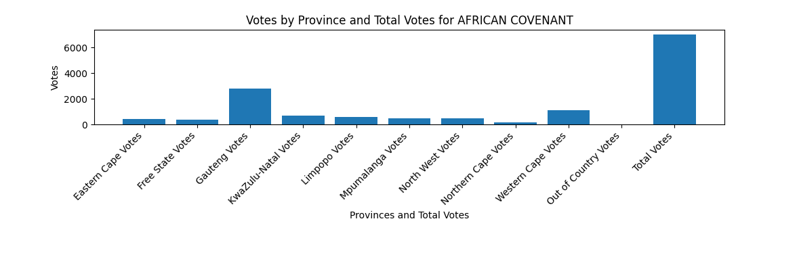

# IEC Voting Data Analysis

## Summary
Analysing the data of the National Elections in South Africa. In line with ci / cd, this project is still in progress and contributers are welcome

##### The objective this project aims to address:
    
    1. Looking at individual parties and provinces they get majority of their votes

## Output ([gallery](project-output/Gallery.md))

## Project Status 

1. The core functionality is completed and includes:
    - Automated script for cleaning the given spreadsheets
    - Automated script for data analysis
    - On the fly changing party and year of election to analyse
    - Bar graph plotting from data
    - Pie chart plotting from data

## Data cleaning
An approach to properly clean and format the data was needed to be able to perform analysis on it.

## System Requirements:
- A linux operating system
- Python3
- Pip

## Additional requirements:
- Internet access (for dependency installation)

## Getting Started
1. Clone the repository
2. Navigate to the project directory

## Setup:
1. Install dependencies
        
        sudo apt-get install python3-tk
        pip install -r dependencies/requirements.txt
2. Run the script

        python3 project.py

## Contributing

Contributions are welcome! If you find any issues or have suggestions for improvements, please open an issue or submit a pull request.

## Contributor

Nkosikhona Mlaba